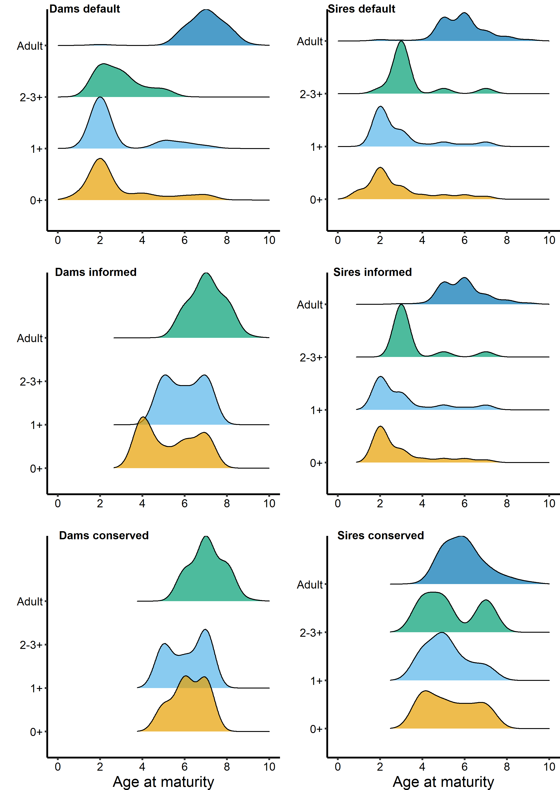

# Analysis of teno salmon pedigree (2011-2019) Utsjoki, Finland

## Data prep: adult collection data
Calculate seaage for samples missing weight, calculate residuals for condition factor

Rscript: ```Uts_adults_cleanup.R```

Dependent datafiles:
```Uts_Adult_2011-2019.csv``` #collection data for adults including scale data

Output data file: 
```UtsadultsALL_21.06.22.csv```

## Data prep: SNP dataset 
cleanup and combine SNP dataset with parentage, adult info, and sex for adults and juveniles (i.e. 'parr')

Rscript: ```Uts_SNP_master_cleanup.R```

Dependent datafiles: 
```UtsSNPMasterDataKM_20.11.24.csv``` #Data from raw sequencing files, corrected and concatenated, 
```UtsadultsALL_21.06.22.csv``` #Adult collection data cleaned,
```2021-02-18.uts_lifehist.csv``` #Data from @henryjuho of rough estimate of birth (hatch) year

Output data file: ```UtsSNP_21.04.13.csv```

## Data prep: birthyear (i.e. hatch year) calculations 
Hatch year calculations and cleanup 

Rscript: ```Birthyear_cleanup.R```

Dependent datafiles: 
```UtsSNP_21.04.13.csv``` #SNP data cleaned,
```UtsadultsALL_21.06.22.csv``` #Adult collection data cleaned

Output data file: ```Uts_Birthyear_Calc_21_06_22.csv```


## Data prep: Parr scale data 
Utsjoki parr scale dataset, information for mature male parr

Rscript: ```Uts.parr.scale.data.cleanup.R```

Dependent datafiles:
```parr_data_combined_22.10.21``` #parr scale data combined over 2012-2019

Output data file: ```Uts.parr.scale_23.06.09.csv```

## Data prep: Parr collection and SNP data 
collection data combined with SNP data 

Rscript: ```Uts.parr.SNP.data.cleanup.R #Utsjoki parr SNP data``` 

Dependent datafiles:
```juv.location.SNP_22.10.21.csv``` #collection data for parr combined with SNP data 

Output data file: ```Uts.parr.SNP_23.06.09.csv```

## Data prep: default parentage analysis results 
original dataset from @henryjuho and renamed,
default = all age difference priors as estimated by sequoia

Rscript: ```Uts_parentage_default_cleanup.R``` #parentage dataset cleanup default

Dependentt data files:
```UtsSNP_21.04.13.csv``` #SNP data cleaned,
```UtsadultsALL_21.06.22.csv``` #Adult collection data cleaned,
```uts_default.prior0.parents.2021-06-18.csv``` #from @henryjuho (original file renamed 2021-06-18.uts_default.prior0.parents.csv)

Output data file: ```Uts_parentage_default_21.06.22.csv```

## Data prep: informed parentage analysis results 
original dataset from @henryjuho and renamed,
informed = priors for age gap of 0 and 1 for males, and 0, 1, 2 and 3 for females set to 0

Rscript: ```Uts_parentage_informed_new_cleanup.R``` #parentage dataset cleanup informed

Dependent data files:
```UtsSNP_21.04.13.csv``` #SNP data cleaned,
```UtsadultsALL_21.06.22.csv``` #Adult collection data cleaned,
```Uts_Birthyear_Calc_21_06_22.csv``` #hatch year calculations

```uts_informed.prior1.parents.2021-06-18.csv``` #from @henryjuho (original file renamed 2021-06-18.uts_informed.prior1.parents.csv)

Output data file: ```Uts_parentage_informed_21.06.22.csv```

## Data prep: Conservative parentage analysis results 
original dataset from @henryjuho and renamed,
conservative = all priors less than 0.1 set to zero, to exclude all of the most improbable relationships

Rscript: ```Uts_parentage_conserved.21.06.18_cleanup_new.R``` #parentage dataset cleanup conservative

Dependentt data files:
```UtsSNP_21.04.13.csv``` #SNP data cleaned,
```UtsadultsALL_21.06.22.csv``` #Adult collection data cleaned,
```Uts_Birthyear_Calc_21_06_22.csv``` #hatch year calculations,
```uts_conservative.prior2.parents_2021-06-18.csv``` #from @henryjuho (original file renamed 2021-06-18.uts_conservative.prior2.parents.csv)

Output data file: ```Uts_parentage_conserved_21.06.22.csv``` 

## Data prep: Calculate the number of reproductive events (cohorts) and offspring for each reproductive event for individual sires and dams using the default parentage analysis dataset

Rscript: ```Uts_cohort_SNP_default_cleanup_MMPtweak.R``` #parentage dataset cleanup default

Dependent data files:
```UtsSNP_21.04.13.csv``` #SNP data cleaned,
```Uts_Birthyear_Calc_21_06_22.csv``` #hatch year calculations,
```Uts_parentage_default_21.06.22.csv``` #default parentage data cleaned up,

Output data file: ```Uts_cohort_SNP_default_11.02.22.csv``` 

### How many offspring are assigned to dams and sires?
```
> #starting sum of offspring
> #dams
> Uts_parentage_default %>% filter(!is.na(dam)) %>% ungroup() %>% count()
     n
1 4360
> #sires
> Uts_parentage_default %>% filter(!is.na(sire)) %>% ungroup() %>% count()
     n
1 6082
```

### Check how many offspring fall into a descrete reproductive event (i.e. cohort year)
```
> Uts_default_dams_cohortyear_assignment_check %>% ungroup() %>% tally(cohort.year.correct)
# A tibble: 1 × 1
      n
  <dbl>
1  4297
> # check incorrect assignments (dams)
> Uts_default_dams_cohortyear_assignment_check %>% ungroup() %>% tally(cohort.year.incorrect)
# A tibble: 1 × 1
      n
  <dbl>
1    63
> #check correct assignments (sires)
> Uts_default_sires_cohortyear_assignment_check %>% ungroup() %>% tally(cohort.year.correct)
# A tibble: 1 × 1
      n
  <dbl>
1  6006
> # check incorrect assignments (sires)
> Uts_default_sires_cohortyear_assignment_check %>% ungroup() %>% tally(cohort.year.incorrect)
# A tibble: 1 × 1
      n
  <dbl>
1    75
```
## Data prep: Calculate the number of reproductive events (cohorts) and offspring for each reproductive event for individual sires and dams using the informed parentage analysis dataset

Rscript: ```Uts_cohort_SNP_informed_cleanup_MMPtweak.R``` #parentage dataset cleanup informed

Dependent data files:
```UtsSNP_21.04.13.csv``` #SNP data cleaned,
```Uts_Birthyear_Calc_21_06_22.csv``` #hatch year calculations,
```Uts_parentage_informed_21.06.22.csv``` #informed parentage data cleaned up

Output data file: ```Uts_cohort_SNP_informed_11.02.22.csv``` 

### How many offspring are assigned to dams and sires?
```
> #starting sum of offspring
> #dams
> Uts_parentage_informed %>% filter(!is.na(dam)) %>% ungroup() %>% count()
     n
1 4283
> #sires
> Uts_parentage_informed %>% filter(!is.na(sire)) %>% ungroup() %>% count()
     n
1 6077
```
### Check how many offspring fall into a descrete reproductive event (i.e. cohort year)
```
> #check correct assignments (dams)
> Uts_informed_dams_cohortyear_assignment_check %>% ungroup() %>% tally(cohort.year.correct)
# A tibble: 1 × 1
      n
  <dbl>
1  4221
> # check incorrect assignments (dams)
> Uts_informed_dams_cohortyear_assignment_check %>% ungroup() %>% tally(cohort.year.incorrect)
# A tibble: 1 × 1
      n
  <dbl>
1    62
> #check correct assignments (sires)
> Uts_informed_sires_cohortyear_assignment_check %>% ungroup() %>% tally(cohort.year.correct)
# A tibble: 1 × 1
      n
  <dbl>
1  5998
> # check incorrect assignments (sires)
> Uts_informed_sires_cohortyear_assignment_check %>% ungroup() %>% tally(cohort.year.incorrect)
# A tibble: 1 × 1
      n
  <dbl>
1    78
```

## Data prep: Calculate the number of reproductive events (cohorts) and offspring for each reproductive event for individual sires and dams using the conservative parentage analysis dataset

Rscript: ```Uts_cohort_SNP_conserved_cleanup_MMPtweak.R``` #parentage dataset cleanup conservative

Dependent data files:
```UtsSNP_21.04.13.csv``` #SNP data cleaned,
```Uts_Birthyear_Calc_21_06_22.csv``` #hatch year calculations,
```Uts_parentage_conserved_21.06.22.csv``` #conservative parentage data cleaned up

Output data file: ```Uts_cohort_SNP_cons_11.02.22.csv``` 

### How many offspring are assigned to dams and sires?

```
> #starting sum of offspring
> #dams
> Uts_parentage_cons %>% filter(!is.na(dam)) %>% ungroup() %>% count()
     n
1 4276
> #sires
> Uts_parentage_cons %>% filter(!is.na(sire)) %>% ungroup() %>% count()
     n
1 5954
```
### Check how many offspring fall into a descrete reproductive event (i.e. cohort year)
```
> #check correct assignments (dams)
> Uts_cons_dams_cohortyear_assignment_check %>% ungroup() %>% tally(cohort.year.correct)
# A tibble: 1 × 1
      n
  <dbl>
1  4214
> # check incorrect assignments (dams)
> Uts_cons_dams_cohortyear_assignment_check %>% ungroup() %>% tally(cohort.year.incorrect)
# A tibble: 1 × 1
      n
  <dbl>
1    62
> #check cocorrect assignments (sires)
> Uts_cons_sires_cohortyear_assignment_check %>% ungroup() %>% tally(cohort.year.correct)
# A tibble: 1 × 1
      n
  <dbl>
1  5876
> # check incorrect assignments (sires)
> Uts_cons_sires_cohortyear_assignment_check %>% ungroup() %>% tally(cohort.year.incorrect)
# A tibble: 1 × 1
      n
  <dbl>
1    78
```
## Data analysis: parentage analysis methods 
compare assignment of offspring by the different parentage analysis methods (default, informed, conservative)

Rscript: ```Uts_parentage_analysis_comparison.R```

Dependent data files:
```Uts_cohort_SNP_default_11.02.22.csv``` #data for reproductive events (default),
```Uts_cohort_SNP_informed_11.02.22.csv``` #data for reproductive events (informed),
```Uts_cohort_SNP_conservative_11.02.22.csv``` #data for reproductive events (conservative)

### Output: How many sires and dams as parents as adults or parr?
```
> #how many unique sires and dams as parents? (default dataset)
> Uts_cohort_SNP_default %>%
+   select(ID, sex, type, n.offspring) %>%
+   group_by(sex, type) %>%
+   summarise(count = n_distinct(ID))
`summarise()` has grouped output by 'sex'. You can override using the `.groups` argument.
# A tibble: 4 × 3
# Groups:   sex [2]
  sex   type      count
  <chr> <chr>     <int>
1 dam   Adult        77
2 dam   Offspring    90
3 sire  Adult       309
4 sire  Offspring   138
> #how many unique sires and dams as parents? (informed dataset)
> Uts_cohort_SNP_informed %>%
+   select(ID, sex, type, n.offspring) %>%
+   group_by(sex, type) %>%
+   summarise(count = n_distinct(ID))
`summarise()` has grouped output by 'sex'. You can override using the `.groups` argument.
# A tibble: 4 × 3
# Groups:   sex [2]
  sex   type      count
  <chr> <chr>     <int>
1 dam   Adult        77
2 dam   Offspring    25
3 sire  Adult       305
4 sire  Offspring   134
> #how many unique sires and dams as parents? (conserved dataset)
> Uts_cohort_SNP_conserved %>%
+   select(ID, sex, type, n.offspring) %>%
+   group_by(sex, type) %>%
+   summarise(count = n_distinct(ID))
`summarise()` has grouped output by 'sex'. You can override using the `.groups` argument.
# A tibble: 4 × 3
# Groups:   sex [2]
  sex   type      count
  <chr> <chr>     <int>
1 dam   Adult        77
2 dam   Offspring    20
3 sire  Adult       301
4 sire  Offspring    36
```
### How many offspring assigned to sires and dams as adults or parr?
```
> #how many offspring assigned to sires and dams? (default dataset)
> Uts_cohort_SNP_default %>%
+   select(ID, sex, type, n.offspring) %>%
+   group_by(sex, type) %>%
+   tally(n.offspring)
# A tibble: 4 × 3
# Groups:   sex [2]
  sex   type          n
  <chr> <chr>     <int>
1 dam   Adult      4253
2 dam   Offspring   107
3 sire  Adult      5915
4 sire  Offspring   167
> #how many offspring assigned to sires and dams? (informed dataset)
> Uts_cohort_SNP_informed %>%
+   select(ID, sex, type, n.offspring) %>%
+   group_by(sex, type) %>%
+   tally(n.offspring)
# A tibble: 4 × 3
# Groups:   sex [2]
  sex   type          n
  <chr> <chr>     <int>
1 dam   Adult      4257
2 dam   Offspring    26
3 sire  Adult      5912
4 sire  Offspring   165
> #how many offspring assigned to sires and dams? (conserved dataset)
> Uts_cohort_SNP_conserved %>%
+   select(ID, sex, type, n.offspring) %>%
+   group_by(sex, type) %>%
+   tally(n.offspring)
# A tibble: 4 × 3
# Groups:   sex [2]
  sex   type          n
  <chr> <chr>     <int>
1 dam   Adult      4255
2 dam   Offspring    21
3 sire  Adult      5912
4 sire  Offspring    42
```
### Ridgeline density plots of age at maturity 
the backcalculated age at first reproduction (ageatmaturity = firstcohort - birthyear.int) for different parentage analysis methods



## Data analysis: Comparison of parentage methods estimating the number of offspring sired by mature male parr

Rscript: ```Parentage_mathods_mature_male_parr.R```

Dependent data files:
```Uts_cohort_SNP_default_11.02.22.csv``` #data for reproductive events (default),
```Uts_cohort_SNP_informed_11.02.22.csv``` #data for reproductive events (informed),
```Uts_cohort_SNP_conservative_11.02.22.csv``` #data for reproductive events (conservative)

### Output: default parentage analysis
```
# count adults and offspring as adults
> Uts_cohort_SNP_default_MMP_RS_wide %>% group_by(type) %>% summarise(non_na_count = sum(!is.na(Adult)))
# A tibble: 2 × 2
  type      non_na_count
  <chr>            <int>
1 Adult              301
2 Offspring           31
> # count adults and offspring as MMP
> Uts_cohort_SNP_default_MMP_RS_wide %>% group_by(type) %>% summarise(non_na_count = sum(!is.na(MMP))) 
# A tibble: 2 × 2
  type      non_na_count
  <chr>            <int>
1 Adult               14
2 Offspring          108
> # tally adults and offspring as adults
> Uts_cohort_SNP_default_MMP_RS_wide %>% group_by(type) %>% tally(Adult)
# A tibble: 2 × 2
  type          n
  <chr>     <int>
1 Adult      5896
2 Offspring    33
> # tally adults and offspring as MMP
> Uts_cohort_SNP_default_MMP_RS_wide %>% group_by(type) %>% tally(MMP) 
# A tibble: 2 × 2
  type          n
  <chr>     <int>
1 Adult        19
2 Offspring   134
```
### Output: informed parentage analysis
```
> # count adults and offspring as adults
> Uts_cohort_SNP_informed_MMP_RS_wide %>% group_by(type) %>% summarise(non_na_count = sum(!is.na(Adult)))
# A tibble: 2 × 2
  type      non_na_count
  <chr>            <int>
1 Adult              301
2 Offspring           31
> # count adults and offspring as MMP
> Uts_cohort_SNP_informed_MMP_RS_wide %>% group_by(type) %>% summarise(non_na_count = sum(!is.na(MMP))) 
# A tibble: 2 × 2
  type      non_na_count
  <chr>            <int>
1 Adult                7
2 Offspring          104
> # tally adults and offspring as adults
> Uts_cohort_SNP_informed_MMP_RS_wide %>% group_by(type) %>% tally(Adult)
# A tibble: 2 × 2
  type          n
  <chr>     <int>
1 Adult      5900
2 Offspring    33
> # tally adults and offspring as MMP
> Uts_cohort_SNP_informed_MMP_RS_wide %>% group_by(type) %>% tally(MMP) 
# A tibble: 2 × 2
  type          n
  <chr>     <int>
1 Adult        11
2 Offspring   132
```
### Output: conserved parentage analysis
```
> # count adults and offspring as adults
> Uts_cohort_SNP_conserved_MMP_RS_wide %>% group_by(type) %>% summarise(non_na_count = sum(!is.na(Adult)))
# A tibble: 2 × 2
  type      non_na_count
  <chr>            <int>
1 Adult              301
2 Offspring           36
> # count adults and offspring as MMP
> Uts_cohort_SNP_conserved_MMP_RS_wide %>% group_by(type) %>% summarise(non_na_count = sum(!is.na(MMP))) 
# A tibble: 2 × 2
  type      non_na_count
  <chr>            <int>
1 Adult                3
2 Offspring            0
> # tally adults and offspring as adults
> Uts_cohort_SNP_conserved_MMP_RS_wide %>% group_by(type) %>% tally(Adult)
# A tibble: 2 × 2
  type          n
  <chr>     <int>
1 Adult      5909
2 Offspring    42
> # tally adults and offspring as MMP
> Uts_cohort_SNP_conserved_MMP_RS_wide %>% group_by(type) %>% tally(MMP) 
# A tibble: 2 × 2
  type          n
  <chr>     <int>
1 Adult         3
2 Offspring     0
```


