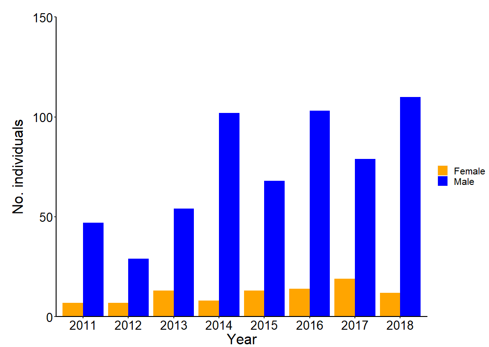
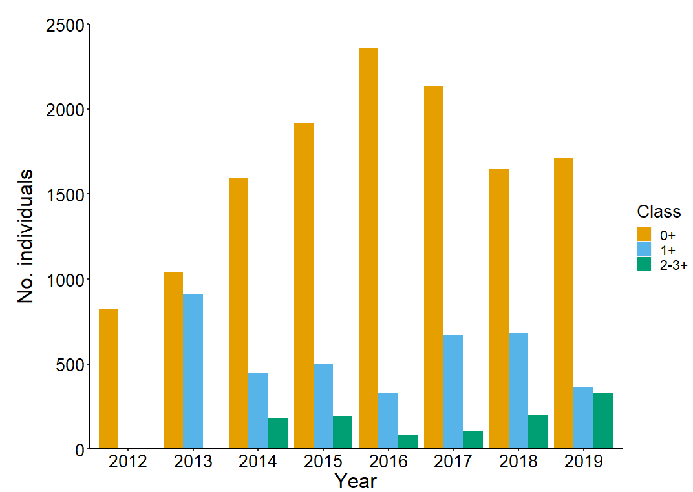
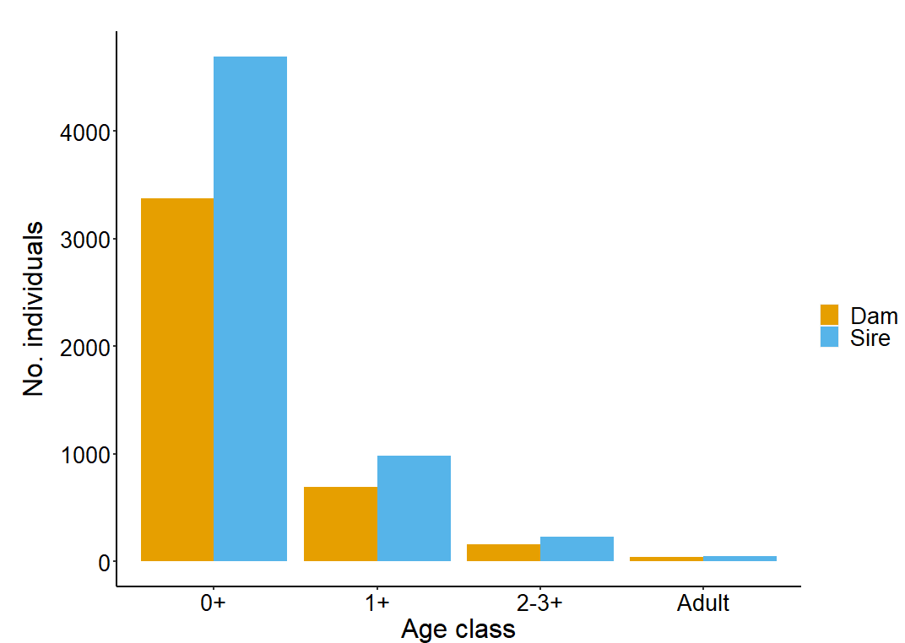
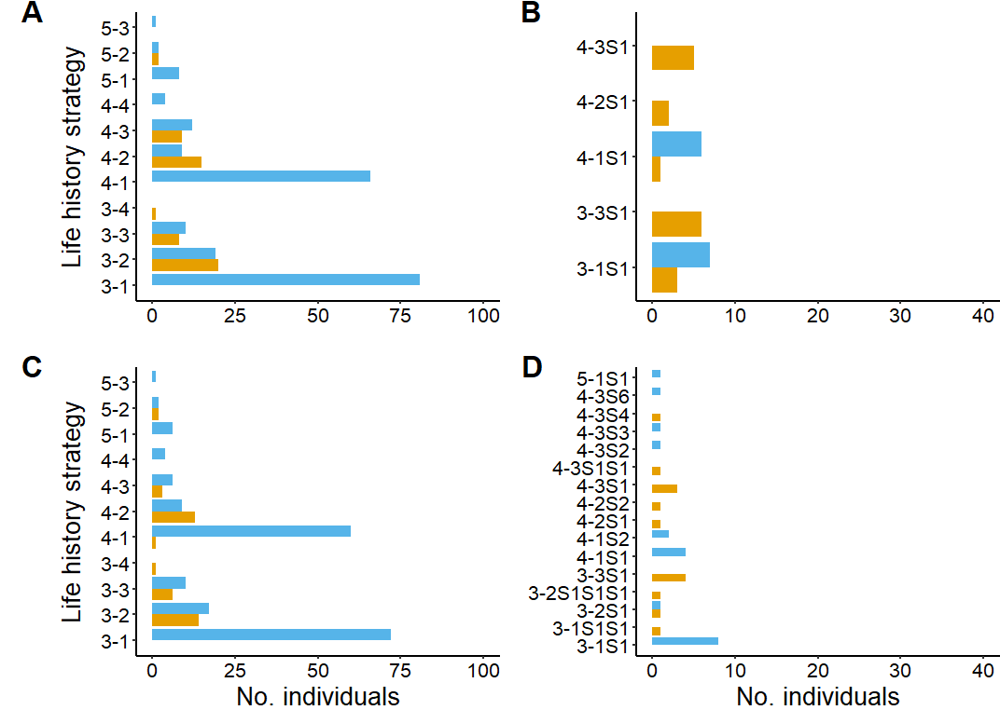
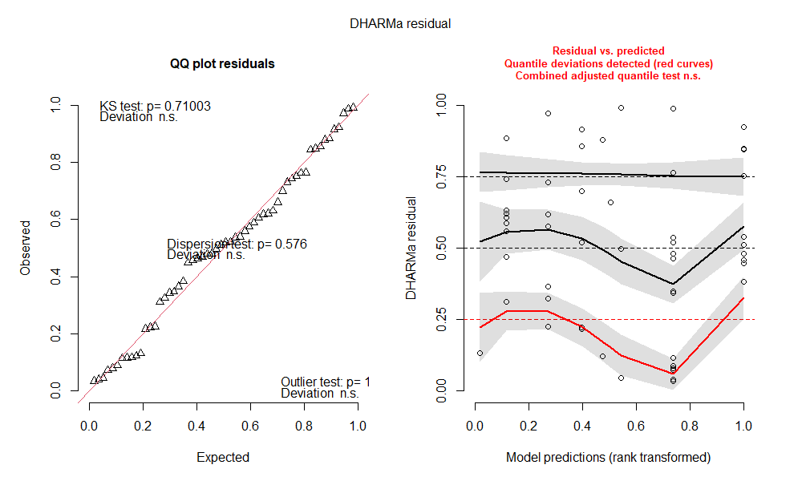
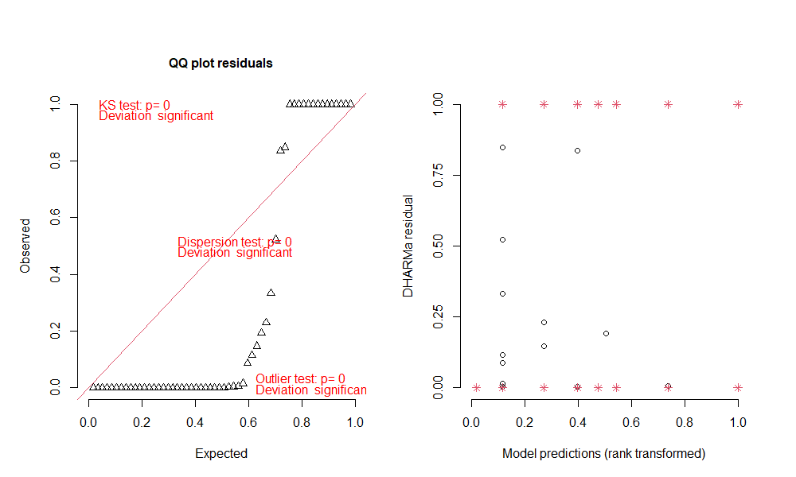
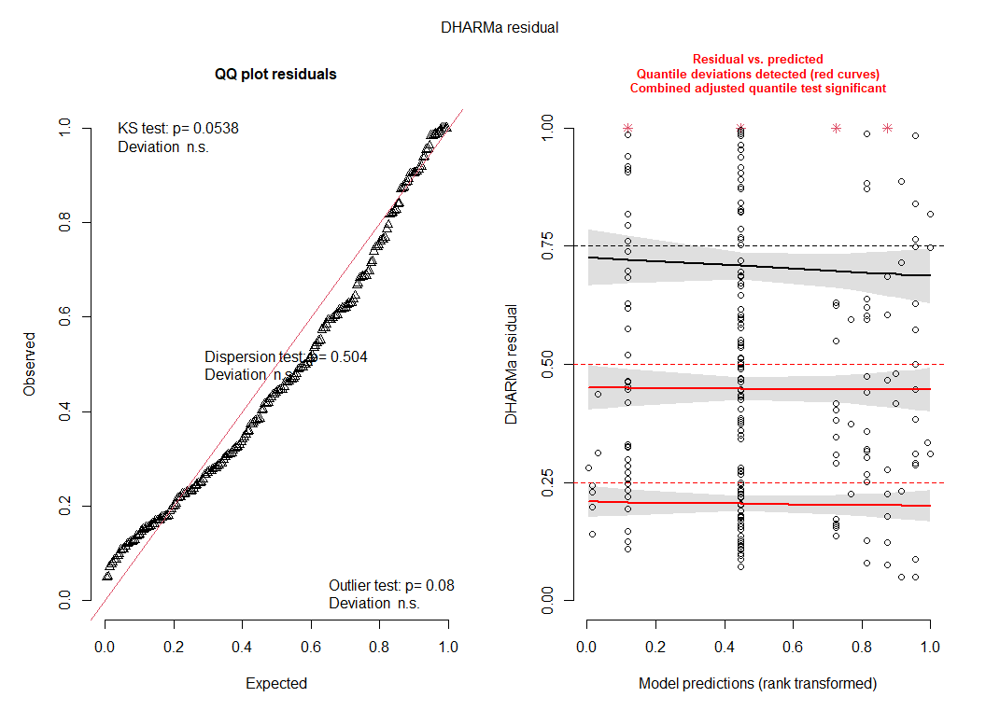
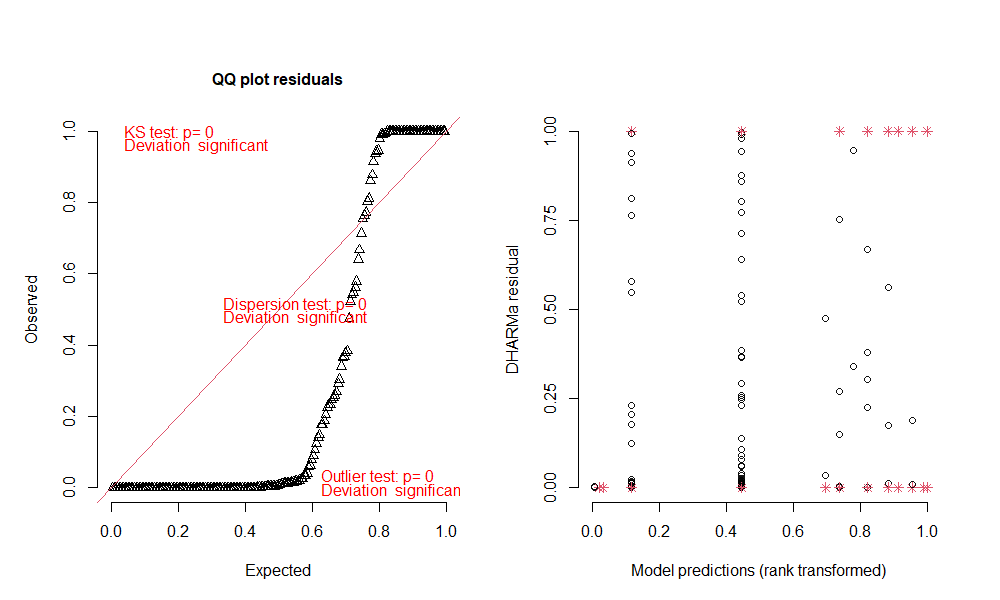

# Analysis of teno salmon pedigree (2011-2019) Utsjoki, Finland

## Data prep: adult collection data
Calculate seaage for samples missing weight, calculate residuals for condition factor

Rscript: ```Uts_adults_cleanup.R```

Dependent datafiles: ```Uts_Adult_2011-2019.csv``` #collection data for adults including scale data

Output data file: ```UtsadultsALL_21.06.22.csv```

## Data prep: SNP dataset 
cleanup and combine SNP dataset with parentage, adult info, and sex for adults and juveniles (i.e. 'parr')

Rscript: ```Uts_SNP_master_cleanup.R```

Dependent datafiles:
```UtsSNPMasterDataKM_20.11.24.csv``` #Data from raw sequencing files, corrected and concatenated,
```UtsadultsALL_21.06.22.csv``` #Adult collection data cleaned,
```2021-02-18.uts_lifehist.csv``` #Data from @henryjuho of rough estimate of birth (hatch) year 

Output data file: ```UtsSNP_21.04.13.csv```

## Data prep: birthyear (i.e. hatch year) calculations 
Hatch year calculations and cleanup 

Rscript: ```Birthyear_cleanup.R```

Dependent datafiles: 
```UtsSNP_21.04.13.csv``` #SNP data cleaned,
```UtsadultsALL_21.06.22.csv``` #Adult collection data cleaned

Output data file: ```Uts_Birthyear_Calc_21_06_22.csv```

## Data prep: Parr scale data 
Utsjoki parr scale dataset, analysis for Mature male parr

Rscript: ```Uts.parr.scale.data.cleanup.R``` 

Dependent datafiles:
```parr_data_combined_22.10.21.csv``` #parr scale data combined over 2012-2019

Output data file: ```Uts.parr.scale_23.06.09.csv```

## Data prep: Parr collection and SNP data 
collection data combined with SNP data 

Rscript ```Uts.parr.SNP.data.cleanup.R``` #Utsjoki parr SNP data 

Dependent datafiles:
```juv.location.SNP_22.10.21.csv``` #collection data for parr combined with SNP data 

Output data file: ```Uts.parr.SNP_23.06.09.csv```

## Data prep: default parentage analysis results 
original dataset from @henryjuho and renamed,
default = all age difference priors as estimated by sequoia

Rscript: ```Uts_parentage_default_cleanup.R``` #parentage dataset cleanup default

Dependentt data files:
```UtsSNP_21.04.13.csv``` #SNP data cleaned,
```UtsadultsALL_21.06.22.csv``` #Adult collection data cleaned,
```Uts_Birthyear_Calc_21_06_22.csv``` #hatch year calculations
```uts_default.prior0.parents.2021-06-18.csv``` #from @henryjuho (original file renamed 2021-06-18.uts_default.prior0.parents.csv)

Output data file: ```Uts_parentage_default_21.06.22.csv```

## Data prep: informed parentage analysis results 
original dataset from @henryjuho and renamed,
informed = priors for age gap of 0 and 1 for males, and 0, 1, 2 and 3 for females set to 0

Rscript: ```Uts_parentage_informed_new_cleanup.R``` #parentage dataset cleanup informed

Dependent data files:
```UtsSNP_21.04.13.csv``` #SNP data cleaned,
```UtsadultsALL_21.06.22.csv``` #Adult collection data cleaned,
```Uts_Birthyear_Calc_21_06_22.csv``` #hatch year calculations,
```uts_informed.prior1.parents.2021-06-18.csv``` #from @henryjuho (original file renamed 2021-06-18.uts_informed.prior1.parents.csv)

Output data file: ```Uts_parentage_informed_21.06.22.csv```

## Data prep: Conservative parentage analysis results 
original dataset from @henryjuho and renamed,
conservative = all priors less than 0.1 set to zero, to exclude all of the most improbable relationships

Rscript: ```Uts_parentage_conserved.21.06.18_cleanup_new.R``` #parentage dataset cleanup conservative

Dependent data files:
```UtsSNP_21.04.13.csv``` #SNP data cleaned,
```UtsadultsALL_21.06.22.csv``` #Adult collection data cleaned,
```Uts_Birthyear_Calc_21_06_22.csv``` #hatch year calculations,
```uts_conservative.prior2.parents_2021-06-18.csv``` #from @henryjuho (original file renamed 2021-06-18.uts_conservative.prior2.parents.csv)

Output data file: ```Uts_parentage_conserved_21.06.22.csv``` 

## Data prep: Calculate the number of reproductive events (cohorts) and offspring for each reproductive event for individual sires and dams using the default parentage analysis dataset

Rscript: ```Uts_cohort_SNP_default_cleanup_MMPtweak.R``` #parentage dataset cleanup default

Dependent data files:
```UtsSNP_21.04.13.csv``` #SNP data cleaned,
```Uts_Birthyear_Calc_21_06_22.csv``` #hatch year calculations,
```Uts_parentage_default_21.06.22.csv``` #default parentage data cleaned up,

Output data file: ```Uts_cohort_SNP_default_11.02.22.csv``` 

### How many offspring are assigned to dams and sires?
```
> #starting sum of offspring
> #dams
> Uts_parentage_default %>% filter(!is.na(dam)) %>% ungroup() %>% count()
     n
1 4360
> #sires
> Uts_parentage_default %>% filter(!is.na(sire)) %>% ungroup() %>% count()
     n
1 6082
```
### Check how many offspring fall into a descrete reproductive event (i.e. cohort year)
```
> Uts_default_dams_cohortyear_assignment_check %>% ungroup() %>% tally(cohort.year.correct)
# A tibble: 1 × 1
      n
  <dbl>
1  4297
> # check incorrect assignments (dams)
> Uts_default_dams_cohortyear_assignment_check %>% ungroup() %>% tally(cohort.year.incorrect)
# A tibble: 1 × 1
      n
  <dbl>
1    63
> #check correct assignments (sires)
> Uts_default_sires_cohortyear_assignment_check %>% ungroup() %>% tally(cohort.year.correct)
# A tibble: 1 × 1
      n
  <dbl>
1  6006
> # check incorrect assignments (sires)
> Uts_default_sires_cohortyear_assignment_check %>% ungroup() %>% tally(cohort.year.incorrect)
# A tibble: 1 × 1
      n
  <dbl>
1    75
```
## Data prep: Calculate the number of reproductive events (cohorts) and offspring for each reproductive event for individual sires and dams using the informed parentage analysis dataset

Rscript: ```Uts_cohort_SNP_informed_cleanup_MMPtweak.R``` #parentage dataset cleanup informed

Dependent data files:
```UtsSNP_21.04.13.csv``` #SNP data cleaned,
```Uts_Birthyear_Calc_21_06_22.csv``` #hatch year calculations,
```Uts_parentage_informed_21.06.22.csv``` #informed parentage data cleaned up

Output data file: ```Uts_cohort_SNP_informed_11.02.22.csv``` 

### How many offspring are assigned to dams and sires?
```
> #starting sum of offspring
> #dams
> Uts_parentage_informed %>% filter(!is.na(dam)) %>% ungroup() %>% count()
     n
1 4283
> #sires
> Uts_parentage_informed %>% filter(!is.na(sire)) %>% ungroup() %>% count()
     n
1 6077
```
### Check how many offspring fall into a descrete reproductive event (i.e. cohort year)
```
> #check correct assignments (dams)
> Uts_informed_dams_cohortyear_assignment_check %>% ungroup() %>% tally(cohort.year.correct)
# A tibble: 1 × 1
      n
  <dbl>
1  4221
> # check incorrect assignments (dams)
> Uts_informed_dams_cohortyear_assignment_check %>% ungroup() %>% tally(cohort.year.incorrect)
# A tibble: 1 × 1
      n
  <dbl>
1    62
> #check correct assignments (sires)
> Uts_informed_sires_cohortyear_assignment_check %>% ungroup() %>% tally(cohort.year.correct)
# A tibble: 1 × 1
      n
  <dbl>
1  5998
> # check incorrect assignments (sires)
> Uts_informed_sires_cohortyear_assignment_check %>% ungroup() %>% tally(cohort.year.incorrect)
# A tibble: 1 × 1
      n
  <dbl>
1    78
```

## Data prep: Calculate the number of reproductive events (cohorts) and offspring for each reproductive event for individual sires and dams using the conservative parentage analysis dataset

Rscript: ```Uts_cohort_SNP_conserved_cleanup_MMPtweak.R``` #parentage dataset cleanup conservative

Dependent data files:
```UtsSNP_21.04.13.csv``` #SNP data cleaned,
```Uts_Birthyear_Calc_21_06_22.csv``` #hatch year calculations,
```Uts_parentage_conserved_21.06.22.csv``` #conservative parentage data cleaned up

Output data file: ```Uts_cohort_SNP_cons_11.02.22.csv``` 

### How many offspring are assigned to dams and sires?

```
> #starting sum of offspring
> #dams
> Uts_parentage_cons %>% filter(!is.na(dam)) %>% ungroup() %>% count()
     n
1 4276
> #sires
> Uts_parentage_cons %>% filter(!is.na(sire)) %>% ungroup() %>% count()
     n
1 5954
```
### Check how many offspring fall into a descrete reproductive event (i.e. cohort year)
```
> #check correct assignments (dams)
> Uts_cons_dams_cohortyear_assignment_check %>% ungroup() %>% tally(cohort.year.correct)
# A tibble: 1 × 1
      n
  <dbl>
1  4214
> # check incorrect assignments (dams)
> Uts_cons_dams_cohortyear_assignment_check %>% ungroup() %>% tally(cohort.year.incorrect)
# A tibble: 1 × 1
      n
  <dbl>
1    62
> #check cocorrect assignments (sires)
> Uts_cons_sires_cohortyear_assignment_check %>% ungroup() %>% tally(cohort.year.correct)
# A tibble: 1 × 1
      n
  <dbl>
1  5876
> # check incorrect assignments (sires)
> Uts_cons_sires_cohortyear_assignment_check %>% ungroup() %>% tally(cohort.year.incorrect)
# A tibble: 1 × 1
      n
  <dbl>
1    78
```
## Data analysis: parentage analysis methods 
compare assignment of offspring by the different parentage analysis methods (default, informed, conservative)

Rscript: ```Uts_parentage_analysis_comparison.R```

Dependent data files:
```Uts_cohort_SNP_default_11.02.22.csv``` #data for reproductive events (default),
```Uts_cohort_SNP_informed_11.02.22.csv``` #data for reproductive events (informed),
```Uts_cohort_SNP_conservative_11.02.22.csv``` #data for reproductive events (conservative)

### Output: How many sires and dams as parents as adults or parr?
```
> #how many unique sires and dams as parents? (default dataset)
> Uts_cohort_SNP_default %>%
+   select(ID, sex, type, n.offspring) %>%
+   group_by(sex, type) %>%
+   summarise(count = n_distinct(ID))
`summarise()` has grouped output by 'sex'. You can override using the `.groups` argument.
# A tibble: 4 × 3
# Groups:   sex [2]
  sex   type      count
  <chr> <chr>     <int>
1 dam   Adult        77
2 dam   Offspring    90
3 sire  Adult       309
4 sire  Offspring   138
> #how many unique sires and dams as parents? (informed dataset)
> Uts_cohort_SNP_informed %>%
+   select(ID, sex, type, n.offspring) %>%
+   group_by(sex, type) %>%
+   summarise(count = n_distinct(ID))
`summarise()` has grouped output by 'sex'. You can override using the `.groups` argument.
# A tibble: 4 × 3
# Groups:   sex [2]
  sex   type      count
  <chr> <chr>     <int>
1 dam   Adult        77
2 dam   Offspring    25
3 sire  Adult       305
4 sire  Offspring   134
> #how many unique sires and dams as parents? (conserved dataset)
> Uts_cohort_SNP_conserved %>%
+   select(ID, sex, type, n.offspring) %>%
+   group_by(sex, type) %>%
+   summarise(count = n_distinct(ID))
`summarise()` has grouped output by 'sex'. You can override using the `.groups` argument.
# A tibble: 4 × 3
# Groups:   sex [2]
  sex   type      count
  <chr> <chr>     <int>
1 dam   Adult        77
2 dam   Offspring    20
3 sire  Adult       301
4 sire  Offspring    36
```
### How many offspring assigned to sires and dams as adults or parr?
```
> #how many offspring assigned to sires and dams? (default dataset)
> Uts_cohort_SNP_default %>%
+   select(ID, sex, type, n.offspring) %>%
+   group_by(sex, type) %>%
+   tally(n.offspring)
# A tibble: 4 × 3
# Groups:   sex [2]
  sex   type          n
  <chr> <chr>     <int>
1 dam   Adult      4253
2 dam   Offspring   107
3 sire  Adult      5915
4 sire  Offspring   167
> #how many offspring assigned to sires and dams? (informed dataset)
> Uts_cohort_SNP_informed %>%
+   select(ID, sex, type, n.offspring) %>%
+   group_by(sex, type) %>%
+   tally(n.offspring)
# A tibble: 4 × 3
# Groups:   sex [2]
  sex   type          n
  <chr> <chr>     <int>
1 dam   Adult      4257
2 dam   Offspring    26
3 sire  Adult      5912
4 sire  Offspring   165
> #how many offspring assigned to sires and dams? (conserved dataset)
> Uts_cohort_SNP_conserved %>%
+   select(ID, sex, type, n.offspring) %>%
+   group_by(sex, type) %>%
+   tally(n.offspring)
# A tibble: 4 × 3
# Groups:   sex [2]
  sex   type          n
  <chr> <chr>     <int>
1 dam   Adult      4255
2 dam   Offspring    21
3 sire  Adult      5912
4 sire  Offspring    42
```
### Ridgeline density plots of age at maturity 
the backcalculated age at first reproduction (ageatmaturity = firstcohort - birthyear.int) for different parentage analysis methods


## Data analysis: Comparison of parentage methods estimating the number of offspring sired by mature male parr

Rscript: ```Parentage_mathods_mature_male_parr.R```

Dependent data files:
```Uts_cohort_SNP_default_11.02.22.csv``` #data for reproductive events (default),
```Uts_cohort_SNP_informed_11.02.22.csv``` #data for reproductive events (informed),
```Uts_cohort_SNP_conservative_11.02.22.csv``` #data for reproductive events (conservative)

### Output: default parentage analysis
```
# count adults and offspring as adults
> Uts_cohort_SNP_default_MMP_RS_wide %>% group_by(type) %>% summarise(non_na_count = sum(!is.na(Adult)))
# A tibble: 2 × 2
  type      non_na_count
  <chr>            <int>
1 Adult              301
2 Offspring           31
> # count adults and offspring as MMP
> Uts_cohort_SNP_default_MMP_RS_wide %>% group_by(type) %>% summarise(non_na_count = sum(!is.na(MMP))) 
# A tibble: 2 × 2
  type      non_na_count
  <chr>            <int>
1 Adult               14
2 Offspring          108
> # tally adults and offspring as adults
> Uts_cohort_SNP_default_MMP_RS_wide %>% group_by(type) %>% tally(Adult)
# A tibble: 2 × 2
  type          n
  <chr>     <int>
1 Adult      5896
2 Offspring    33
> # tally adults and offspring as MMP
> Uts_cohort_SNP_default_MMP_RS_wide %>% group_by(type) %>% tally(MMP) 
# A tibble: 2 × 2
  type          n
  <chr>     <int>
1 Adult        19
2 Offspring   134
```
### Output: informed parentage analysis
```
> # count adults and offspring as adults
> Uts_cohort_SNP_informed_MMP_RS_wide %>% group_by(type) %>% summarise(non_na_count = sum(!is.na(Adult)))
# A tibble: 2 × 2
  type      non_na_count
  <chr>            <int>
1 Adult              301
2 Offspring           31
> # count adults and offspring as MMP
> Uts_cohort_SNP_informed_MMP_RS_wide %>% group_by(type) %>% summarise(non_na_count = sum(!is.na(MMP))) 
# A tibble: 2 × 2
  type      non_na_count
  <chr>            <int>
1 Adult                7
2 Offspring          104
> # tally adults and offspring as adults
> Uts_cohort_SNP_informed_MMP_RS_wide %>% group_by(type) %>% tally(Adult)
# A tibble: 2 × 2
  type          n
  <chr>     <int>
1 Adult      5900
2 Offspring    33
> # tally adults and offspring as MMP
> Uts_cohort_SNP_informed_MMP_RS_wide %>% group_by(type) %>% tally(MMP) 
# A tibble: 2 × 2
  type          n
  <chr>     <int>
1 Adult        11
2 Offspring   132
```
### Output: conserved parentage analysis
```
> # count adults and offspring as adults
> Uts_cohort_SNP_conserved_MMP_RS_wide %>% group_by(type) %>% summarise(non_na_count = sum(!is.na(Adult)))
# A tibble: 2 × 2
  type      non_na_count
  <chr>            <int>
1 Adult              301
2 Offspring           36
> # count adults and offspring as MMP
> Uts_cohort_SNP_conserved_MMP_RS_wide %>% group_by(type) %>% summarise(non_na_count = sum(!is.na(MMP))) 
# A tibble: 2 × 2
  type      non_na_count
  <chr>            <int>
1 Adult                3
2 Offspring            0
> # tally adults and offspring as adults
> Uts_cohort_SNP_conserved_MMP_RS_wide %>% group_by(type) %>% tally(Adult)
# A tibble: 2 × 2
  type          n
  <chr>     <int>
1 Adult      5909
2 Offspring    42
> # tally adults and offspring as MMP
> Uts_cohort_SNP_conserved_MMP_RS_wide %>% group_by(type) %>% tally(MMP) 
# A tibble: 2 × 2
  type          n
  <chr>     <int>
1 Adult         3
2 Offspring     0
```
## Data analysis: Adult dataset 
basic statistics for adult dataset

Rscript: ```Uts_adults_basic_stats.R```

Dependent data files: ```UtsadultsALL_21.06.22.csv```

### adult statistics

```
> #How many adults? 2011 -2018
> Utsadults11_18 %>% count()
    n
1 685
> #how many for each sex?
> Utsadults11_18 %>% group_by(sex) %>% count()
# A tibble: 2 × 2
# Groups:   sex [2]
  sex       n
  <chr> <int>
1 F        93
2 M       592
> #how many are recaptures? (2 = recapture)
> Utsadults11_18 %>% group_by(sex, recapture) %>% count()
# A tibble: 4 × 3
# Groups:   sex, recapture [4]
  sex   recapture     n
  <chr>     <int> <int>
1 F             0    93
2 M             0   577
3 M             1     8
4 M             2     7
> #How many have scale smolt (i.e. freshwater) age? remove recaptures
> Utsadults11_18 %>% filter(recapture <= 1) %>% count(Scale.smoltage)
  Scale.smoltage   n
1              3 329
2              4 265
3              5  30
4              6   1
5             NA  53
> #mean scale age, remove recaptures
> Utsadults11_18 %>% filter(recapture <= 1) %>% select(sex, Scale.smoltage) %>% group_by(sex) %>% dplyr:: summarise_if(is.numeric, funs(mean(., na.rm=T), n = sum(!is.na(.)), se = sd(., na.rm=T)/sqrt(sum(!is.na(.)))))
# A tibble: 2 × 4
  sex    mean     n     se
  <chr> <dbl> <int>  <dbl>
1 F      3.52    81 0.0636
2 M      3.53   544 0.0257
> #How many have seaage age? remove recaptures
> Utsadults11_18 %>% filter(recapture <= 1) %>% count(scale.seaage)
  scale.seaage   n
1            1 466
2            2 101
3            3  78
4            4  14
5            5   8
6           NA  11
> #mean scale age, seaage remove recaptures
> Utsadults11_18 %>% filter(recapture <= 1) %>% select(sex, scale.seaage) %>% group_by(sex) %>% dplyr:: summarise_if(is.numeric, funs(mean(., na.rm=T), n = sum(!is.na(.)), se = sd(., na.rm=T)/sqrt(sum(!is.na(.)))))
# A tibble: 2 × 4
  sex    mean     n     se
  <chr> <dbl> <int>  <dbl>
1 F      2.67    89 0.103 
2 M      1.31   578 0.0288
> ####make table of total individuals#### 
> uts.adults.ind <- Utsadults11_18 %>%
+   count(year, sex) 
```
### bar graph of the number of adults collected for each sex/year



## Data visualization: parr collection data
generate a bar plot that shows the number of offspring collected in each year by age class

Rscript: ```Uts.juv.collection.R```

Dependent datafiles: ```juv.location.SNP_22.10.21.csv``` #collection data for parr combined with SNP data 

### bar graph of the number of parr collected for each year/age class


## Data analysis: Number of offspring assigned to dams/sires for conservative parentage analysis dataset
includes X2 analysis to see whether there are differences in assigment of offspring to dams/sires by age class

Rscript: ```Uts.parentage age class.R```
Dependent datafiles: ```Uts_parentage_conserved_21.06.22.csv``` #conservative parentage data cleaned up

### bar graph of the number of offspring assigned to sires and dams by age class



### calculate % of offspring assigned for each age class
```
Uts_Parentage_classfreq %>% group_by(sex) %>% mutate(total = sum(n)) %>% mutate(percent = n/total*100)
# A tibble: 8 × 5
# Groups:   sex [2]
  sex   class.cor.off     n total percent
  <chr> <chr>         <int> <int>   <dbl>
1 F     0+             3376  4276  79.0  
2 F     1+              697  4276  16.3  
3 F     2-3+            158  4276   3.70 
4 F     Adult            45  4276   1.05 
5 M     0+             4692  5954  78.8  
6 M     1+              983  5954  16.5  
7 M     2-3+            229  5954   3.85 
8 M     Adult            50  5954   0.840
```
### X2 test, distribution between sires/dams over age class
```
> #chi square  
> chisq.test(class.freq.wide2) 

	Pearson's Chi-squared test

data:  class.freq.wide2
X-squared = 1.4352, df = 3, p-value = 0.6973
```
## Data analysis: Life history strategies
calculate life history strategies based on conservative parentage analysis dataset
obs! Only adults with freshwater age and scale age. removed all dams/sires with first reproduction <2012 and >2017

Rscript: ```life history strategies.R```

Dependent datafiles: ```Uts_parentage_conserved_21.06.22.csv``` #conservative parentage data cleaned up

```
 #how many unique LHS if sires and dams are not respawners? (scale data only)
> LHS_Norespawninfo %>% group_by(sex) %>% summarise_all(~sum(. != 0))
# A tibble: 2 × 3
  sex     LHS     n
  <chr> <int> <int>
1 dam      11     6
2 sire     11    10
> #how many unique LHS if how many sires and dams are respawners (scale data only)
> LHS_RS %>% group_by(sex) %>% summarise_all(~sum(. != 0))
# A tibble: 2 × 3
  sex     LHS     n
  <chr> <int> <int>
1 dam       5     5
2 sire      5     2
> #how many unique LHS if how many sires and dams are not respawners? (scale + parentage analysis)
> LHS_gen_Norespawninfo %>% group_by(sex) %>% summarise_all(~sum(. != 0))
# A tibble: 2 × 3
  sex   LHSall     n
  <chr>  <int> <int>
1 dam       11     7
2 sire      11    10
> #how many unique LHS if how many sires and dams are respawners (scale + parentage analysis)
> LHS_gen_RS %>% group_by(sex) %>% summarise_all(~sum(. != 0))
# A tibble: 2 × 3
  sex   LHSall     n
  <chr>  <int> <int>
1 dam       16     9
2 sire      16     8
```
### life history strategies
A) semelparous scale data only, B) iteroparous scale data only, C) semelparous scale and parentage analysis combined, D) iteroparous scale and parentage analysis combined. Notation: freshwater age – sea age, S pause between multiple mating events followed by number of years between reproductive events. 



##Data analysis: mature male parr comparisons
calculate the number of mature male parr collected and compare the distribution of age and size (length) between immature males and females

Rscript: ```Uts.parr.scale.analysis.R```

Dependent datafiles: 
```Uts.parr.scale_23.06.09.csv```#cleaned parr scale data
```Uts.parr.SNP_23.06.09.csv``` #cleaned parr SNP data

### how many mature male parr and what are their ages?
```
> Uts.parr.scale_rmNA_SA %>% filter(mature.male.parr == 1) %>% count(mature.male.parr, scale.age)
  mature.male.parr scale.age  n
1                1         2 21
2                1         3  7
```
### How many immature and mature parr?

```
> #check if mature male parr are counted correctly (yes)
> Uts.parr.scale_sex %>% count(mature2, scale.age) 
        mature2 scale.age   n
1        Female         2 313
2        Female         3  14
3 Immature male         2 279
4 Immature male         3  13
5   Mature male         2  21
6   Mature male         3   7
```
### GLM of maturity and length
```
> #glm of sex category and length
> lm.length.sex <- lm(length.cm ~ mature2, data=Uts.parr.scale_sex, type=3)
Warning message:
In lm.fit(x, y, offset = offset, singular.ok = singular.ok, ...) :
 extra argument ‘type’ will be disregarded 
> #show lm results
> summary(lm.length.sex)

Call:
lm(formula = length.cm ~ mature2, data = Uts.parr.scale_sex, 
    type = 3)

Residuals:
    Min      1Q  Median      3Q     Max 
-4.4286 -0.9286 -0.2067  0.7714  5.0714 

Coefficients:
                     Estimate Std. Error t value Pr(>|t|)    
(Intercept)          10.90675    0.07380 147.787  < 2e-16 ***
mature2Immature male  0.02187    0.10756   0.203    0.839    
mature2Mature male    1.12539    0.26241   4.289 2.07e-05 ***
---
Signif. codes:  0 ‘***’ 0.001 ‘**’ 0.01 ‘*’ 0.05 ‘.’ 0.1 ‘ ’ 1

Residual standard error: 1.333 on 641 degrees of freedom
  (3 observations deleted due to missingness)
Multiple R-squared:  0.02849,	Adjusted R-squared:  0.02546 
F-statistic: 9.399 on 2 and 641 DF,  p-value: 9.482e-05
```
### GLM of maturity and freshwater age (scale.age)
```
> #glm of sex category and length
> lm.scale.age.sex <- lm(scale.age ~ mature2, data=Uts.parr.scale_sex, type=3)
Warning message:
In lm.fit(x, y, offset = offset, singular.ok = singular.ok, ...) :
 extra argument ‘type’ will be disregarded 
> #show lm results
> summary(lm.scale.age.sex)

Call:
lm(formula = scale.age ~ mature2, data = Uts.parr.scale_sex, 
    type = 3)

Residuals:
     Min       1Q   Median       3Q      Max 
-0.25000 -0.04452 -0.04281 -0.04281  0.95719 

Coefficients:
                     Estimate Std. Error t value Pr(>|t|)    
(Intercept)          2.042813   0.012147 168.175  < 2e-16 ***
mature2Immature male 0.001707   0.017686   0.097    0.923    
mature2Mature male   0.207187   0.043252   4.790 2.07e-06 ***
---
Signif. codes:  0 ‘***’ 0.001 ‘**’ 0.01 ‘*’ 0.05 ‘.’ 0.1 ‘ ’ 1

Residual standard error: 0.2197 on 644 degrees of freedom
Multiple R-squared:  0.03543,	Adjusted R-squared:  0.03244 
F-statistic: 11.83 on 2 and 644 DF,  p-value: 9.013e-06
```
### ridgeline density plot of parr scale age and total length
comparison of mature male parr, immature male parr and female parr


## Data analysis: Reproductive fitness with conservative parantage analysis
Using the conservative parentage analysis dataset, create glm models and graphs for reproductive success

Rscript: ```Uts_reprod_fitness_conserved.R```

Dependent datafiles: 
```Uts_parentage_conserved_21.06.22.csv```#cleaned parentage conserved dataset
```Uts_cohort_SNP_cons_11.02.22.csv``` #cleaned reproductive event SNP data
```UtsSNP_21.04.13.csv``` #cleaned SNP data
```UtsadultsALL_21.06.22.csv``` #cleaned adult data
```Uts_Birthyear_Calc_21_06_22.csv``` #cleaned hatch year data

### Calculate the number of offspring assigned to sires and dams, and both for the conservative dataset

```
 # adults vs offspring in conservative dataset
> Uts_parentage_conserved %>%
+   group_by(type.off) %>%
+     tally()
# A tibble: 2 × 2
  type.off      n
  <chr>     <int>
1 Adult       632
2 Offspring 16175
> #sires in conservative dataset
> Uts_parentage_conserved %>%
+   group_by(sex.sire) %>%
+   tally()
# A tibble: 2 × 2
  sex.sire     n
  <chr>    <int>
1 M         5954
2 NA       10853
> #dams in conservative dataset
> Uts_parentage_conserved %>%
+   group_by(sex.dam) %>%
+   tally() 
# A tibble: 2 × 2
  sex.dam     n
  <chr>   <int>
1 F        4276
2 NA      12531
> #adults in conservative dataset
> Uts_parentage_conserved %>%
+   group_by(sex.off, type.off) %>%
+   tally() 
# A tibble: 5 × 3
# Groups:   sex.off [3]
  sex.off type.off      n
  <chr>   <chr>     <int>
1 F       Adult        86
2 F       Offspring  8063
3 M       Adult       546
4 M       Offspring  8106
5 NA      Offspring     6
> #find offspring that have both parents assigned
> Uts_parentage_conserved_both <- Uts_parentage_conserved %>%
+   filter(sex.sire == "M" | sex.dam == "F")
> #both in conservative dataset
> Uts_parentage_conserved_both %>%
+   group_by(type.off) %>%
+   tally()
# A tibble: 2 × 2
  type.off      n
  <chr>     <int>
1 Adult        82
2 Offspring  8094
> #how many total offspring
> Uts_parentage_conserved_both %>%
+   tally()
     n
1 8176
```
### compare negative bionomial, poisson and quasipoisson models for total reproductive success for dams
Note: restricted dataset: remove individuals that have cohorts before 2012, and after 2017
Specifially testing the effect of vgll3 genotype and seaage at maturity on the number of offspring of each dam

#### Negative binomial vgll3 test
```
> #vgll3 additive dams negative binomial
> mod1dams <- glm.nb(n.offspring ~ factor(c25_1441_SAC) + seaageatmaturity, link = log, data=Uts_conserved_total_RS_dams)
> summary(mod1dams)

Call:
glm.nb(formula = n.offspring ~ factor(c25_1441_SAC) + seaageatmaturity, 
    data = Uts_conserved_total_RS_dams, link = log, init.theta = 0.6959126218)

Deviance Residuals: 
    Min       1Q   Median       3Q      Max  
-2.1101  -0.9991  -0.4396   0.1933   2.2201  

Coefficients:
                      Estimate Std. Error z value Pr(>|z|)    
(Intercept)             2.7173     0.6818   3.985 6.74e-05 ***
factor(c25_1441_SAC)2   1.0557     0.4432   2.382   0.0172 *  
factor(c25_1441_SAC)3  -0.3245     0.5008  -0.648   0.5169    
seaageatmaturity        0.3470     0.2682   1.293   0.1958    
---
Signif. codes:  0 ‘***’ 0.001 ‘**’ 0.01 ‘*’ 0.05 ‘.’ 0.1 ‘ ’ 1

(Dispersion parameter for Negative Binomial(0.6959) family taken to be 1)

    Null deviance: 80.219  on 55  degrees of freedom
Residual deviance: 65.825  on 52  degrees of freedom
AIC: 564.31

Number of Fisher Scoring iterations: 1


              Theta:  0.696 
          Std. Err.:  0.117 

 2 x log-likelihood:  -554.311 
 ```
 note: interactions were removed because of NS

DHARMa residual plot: 


### poisson 
```
> #vgll3 additive dams poisson 
> mod2dams <- glm(formula = n.offspring ~ factor(c25_1441_SAC) + seaageatmaturity, family = "poisson", data=Uts_conserved_total_RS_dams)
> summary(mod2dams)

Call:
glm(formula = n.offspring ~ factor(c25_1441_SAC) + seaageatmaturity, 
    family = "poisson", data = Uts_conserved_total_RS_dams)

Deviance Residuals: 
    Min       1Q   Median       3Q      Max  
-12.650   -6.735   -3.492    1.457   33.950  

Coefficients:
                      Estimate Std. Error z value Pr(>|z|)    
(Intercept)            2.71770    0.08209  33.105  < 2e-16 ***
factor(c25_1441_SAC)2  1.00409    0.05823  17.244  < 2e-16 ***
factor(c25_1441_SAC)3 -0.35128    0.07399  -4.748 2.06e-06 ***
seaageatmaturity       0.36314    0.02764  13.139  < 2e-16 ***
---
Signif. codes:  0 ‘***’ 0.001 ‘**’ 0.01 ‘*’ 0.05 ‘.’ 0.1 ‘ ’ 1

(Dispersion parameter for poisson family taken to be 1)

    Null deviance: 6005.6  on 55  degrees of freedom
Residual deviance: 4815.8  on 52  degrees of freedom
AIC: 5101.6

Number of Fisher Scoring iterations: 6
```
with interactions
```
> #vgll3 additive dams poisson 
> mod2dams <- glm(formula = n.offspring ~ factor(c25_1441_SAC) * seaageatmaturity, family = "poisson", data=Uts_conserved_total_RS_dams)
> summary(mod2dams)

Call:
glm(formula = n.offspring ~ factor(c25_1441_SAC) * seaageatmaturity, 
    family = "poisson", data = Uts_conserved_total_RS_dams)

Deviance Residuals: 
    Min       1Q   Median       3Q      Max  
-12.755   -6.462   -3.384    1.707   33.732  

Coefficients:
                                       Estimate Std. Error z value Pr(>|z|)    
(Intercept)                             2.06044    0.23714   8.689  < 2e-16 ***
factor(c25_1441_SAC)2                   1.76371    0.24891   7.086 1.38e-12 ***
factor(c25_1441_SAC)3                   0.08786    0.30890   0.284  0.77608    
seaageatmaturity                        0.65532    0.10060   6.514 7.32e-11 ***
factor(c25_1441_SAC)2:seaageatmaturity -0.33555    0.10532  -3.186  0.00144 ** 
factor(c25_1441_SAC)3:seaageatmaturity -0.21036    0.12345  -1.704  0.08837 .  
---
Signif. codes:  0 ‘***’ 0.001 ‘**’ 0.01 ‘*’ 0.05 ‘.’ 0.1 ‘ ’ 1

(Dispersion parameter for poisson family taken to be 1)

    Null deviance: 6005.6  on 55  degrees of freedom
Residual deviance: 4804.1  on 50  degrees of freedom
AIC: 5094

Number of Fisher Scoring iterations: 6
```
DHARMa residual plot: note, this is the residuals of the no interactions plot, the residuals for the interactions cannot be calculated


#### Quasi-poisson
```
> #qvgll3 additive dams quasi-poisson 
> mod3dams <- glm(formula = n.offspring ~ factor(c25_1441_SAC) + seaageatmaturity, family = "quasipoisson", data=Uts_conserved_total_RS_dams)
> summary(mod3dams)

Call:
glm(formula = n.offspring ~ factor(c25_1441_SAC) + seaageatmaturity, 
    family = "quasipoisson", data = Uts_conserved_total_RS_dams)

Deviance Residuals: 
    Min       1Q   Median       3Q      Max  
-12.650   -6.735   -3.492    1.457   33.950  

Coefficients:
                      Estimate Std. Error t value Pr(>|t|)   
(Intercept)             2.7177     0.9366   2.902  0.00543 **
factor(c25_1441_SAC)2   1.0041     0.6643   1.511  0.13672   
factor(c25_1441_SAC)3  -0.3513     0.8441  -0.416  0.67901   
seaageatmaturity        0.3631     0.3153   1.152  0.25471   
---
Signif. codes:  0 ‘***’ 0.001 ‘**’ 0.01 ‘*’ 0.05 ‘.’ 0.1 ‘ ’ 1

(Dispersion parameter for quasipoisson family taken to be 130.1536)

    Null deviance: 6005.6  on 55  degrees of freedom
Residual deviance: 4815.8  on 52  degrees of freedom
AIC: NA

Number of Fisher Scoring iterations: 6
```
no interactions with quasipoisson
DHARMa residual plot: DHARMa cannot generate residuals, AIC cannot be computed. 

#### Based on these results, negative binomial has the lowest AIC score, predictable residuals and will be used for dam models

### compare negative bionomial, poisson and quasipoisson models for total reproductive success for sires
Note: restricted dataset: remove individuals that have cohorts before 2012, and after 2017
Specifially testing the effect of vgll3 genotype and seaage at maturity on the number of offspring of each sire

#### Negative Binomial

```
> #vgll3 additive sires NB
> mod1sires<- glm.nb(n.offspring ~ factor(c25_1441_SAC) + seaageatmaturity, link = log, data=Uts_conserved_total_RS_sires)
> summary(mod1sires)

Call:
glm.nb(formula = n.offspring ~ factor(c25_1441_SAC) + seaageatmaturity, 
    data = Uts_conserved_total_RS_sires, link = log, init.theta = 0.7721700353)

Deviance Residuals: 
    Min       1Q   Median       3Q      Max  
-2.0756  -1.1690  -0.6110   0.1057   3.3147  

Coefficients:
                      Estimate Std. Error z value Pr(>|z|)    
(Intercept)             1.9360     0.2235   8.664  < 2e-16 ***
factor(c25_1441_SAC)2   0.2174     0.2072   1.049    0.294    
factor(c25_1441_SAC)3   0.2618     0.2721   0.962    0.336    
seaageatmaturity        0.6250     0.1146   5.454 4.93e-08 ***
---
Signif. codes:  0 ‘***’ 0.001 ‘**’ 0.01 ‘*’ 0.05 ‘.’ 0.1 ‘ ’ 1

(Dispersion parameter for Negative Binomial(0.7722) family taken to be 1)

    Null deviance: 293.04  on 215  degrees of freedom
Residual deviance: 244.35  on 212  degrees of freedom
AIC: 1723.7

Number of Fisher Scoring iterations: 1


              Theta:  0.7722 
          Std. Err.:  0.0692 

 2 x log-likelihood:  -1713.6820 
```
no interactions

DHARMa residual plot: negative binomial


### poisson
```
 #vgll3 additive sires poisson 
> mod2sires <- glm(formula = n.offspring ~ factor(c25_1441_SAC) + seaageatmaturity, family = "poisson", data=Uts_conserved_total_RS_sires)
> summary(mod2sires)

Call:
glm(formula = n.offspring ~ factor(c25_1441_SAC) + seaageatmaturity, 
    family = "poisson", data = Uts_conserved_total_RS_sires)

Deviance Residuals: 
     Min        1Q    Median        3Q       Max  
-10.3078   -4.2871   -2.6146    0.4492   22.4114  

Coefficients:
                      Estimate Std. Error z value Pr(>|z|)    
(Intercept)            1.97076    0.04683  42.081  < 2e-16 ***
factor(c25_1441_SAC)2  0.27835    0.04573   6.086 1.16e-09 ***
factor(c25_1441_SAC)3  0.45554    0.05214   8.737  < 2e-16 ***
seaageatmaturity       0.54580    0.01663  32.818  < 2e-16 ***
---
Signif. codes:  0 ‘***’ 0.001 ‘**’ 0.01 ‘*’ 0.05 ‘.’ 0.1 ‘ ’ 1

(Dispersion parameter for poisson family taken to be 1)

    Null deviance: 8124.0  on 215  degrees of freedom
Residual deviance: 6406.2  on 212  degrees of freedom
AIC: 7286.9

Number of Fisher Scoring iterations: 6
```
with interactions
```
> #vgll3 additive sires poisson 
> mod2sires <- glm(formula = n.offspring ~ factor(c25_1441_SAC) * seaageatmaturity, family = "poisson", data=Uts_conserved_total_RS_sires)
> summary(mod2sires)

Call:
glm(formula = n.offspring ~ factor(c25_1441_SAC) * seaageatmaturity, 
    family = "poisson", data = Uts_conserved_total_RS_sires)

Deviance Residuals: 
     Min        1Q    Median        3Q       Max  
-10.4646   -4.4571   -2.4928    0.4789   22.8990  

Coefficients:
                                       Estimate Std. Error z value Pr(>|z|)    
(Intercept)                             2.38481    0.09418  25.322  < 2e-16 ***
factor(c25_1441_SAC)2                  -0.08030    0.10285  -0.781 0.434960    
factor(c25_1441_SAC)3                  -0.18017    0.11774  -1.530 0.125950    
seaageatmaturity                        0.22073    0.07003   3.152 0.001622 ** 
factor(c25_1441_SAC)2:seaageatmaturity  0.28603    0.07461   3.834 0.000126 ***
factor(c25_1441_SAC)3:seaageatmaturity  0.40831    0.07422   5.501 3.77e-08 ***
---
Signif. codes:  0 ‘***’ 0.001 ‘**’ 0.01 ‘*’ 0.05 ‘.’ 0.1 ‘ ’ 1

(Dispersion parameter for poisson family taken to be 1)

    Null deviance: 8124.0  on 215  degrees of freedom
Residual deviance: 6367.6  on 210  degrees of freedom
AIC: 7252.3

Number of Fisher Scoring iterations: 6
```
DHARMa residual plot: note, this is the residuals of the no interactions plot, the residuals for the interactions cannot be calculated


#### Quasi-poisson

```
> #qvgll3 additive sires quasi-poisson 
> mod3sires <- glm(formula = n.offspring ~ factor(c25_1441_SAC) + seaageatmaturity, family = "quasipoisson", data=Uts_conserved_total_RS_sires)
> summary(mod3sires)

Call:
glm(formula = n.offspring ~ factor(c25_1441_SAC) + seaageatmaturity, 
    family = "quasipoisson", data = Uts_conserved_total_RS_sires)

Deviance Residuals: 
     Min        1Q    Median        3Q       Max  
-10.3078   -4.2871   -2.6146    0.4492   22.4114  

Coefficients:
                      Estimate Std. Error t value Pr(>|t|)    
(Intercept)             1.9708     0.3173   6.211 2.74e-09 ***
factor(c25_1441_SAC)2   0.2784     0.3099   0.898    0.370    
factor(c25_1441_SAC)3   0.4555     0.3533   1.290    0.199    
seaageatmaturity        0.5458     0.1127   4.844 2.45e-06 ***
---
Signif. codes:  0 ‘***’ 0.001 ‘**’ 0.01 ‘*’ 0.05 ‘.’ 0.1 ‘ ’ 1

(Dispersion parameter for quasipoisson family taken to be 45.90119)

    Null deviance: 8124.0  on 215  degrees of freedom
Residual deviance: 6406.2  on 212  degrees of freedom
AIC: NA

Number of Fisher Scoring iterations: 6
```
no interactions with quasipoisson
DHARMa residual plot: DHARMa cannot generate residuals, AIC cannot be computed. 

#### Based on these results, negative binomial has the lowest AIC score, predictable residuals and will be used for sire models

### 


